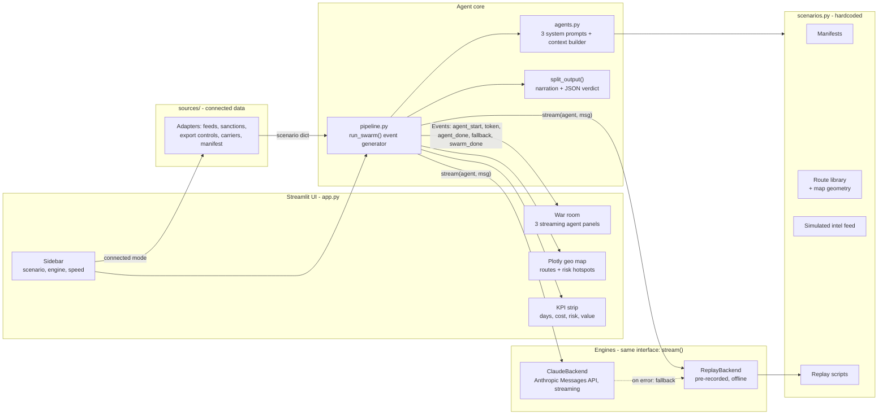
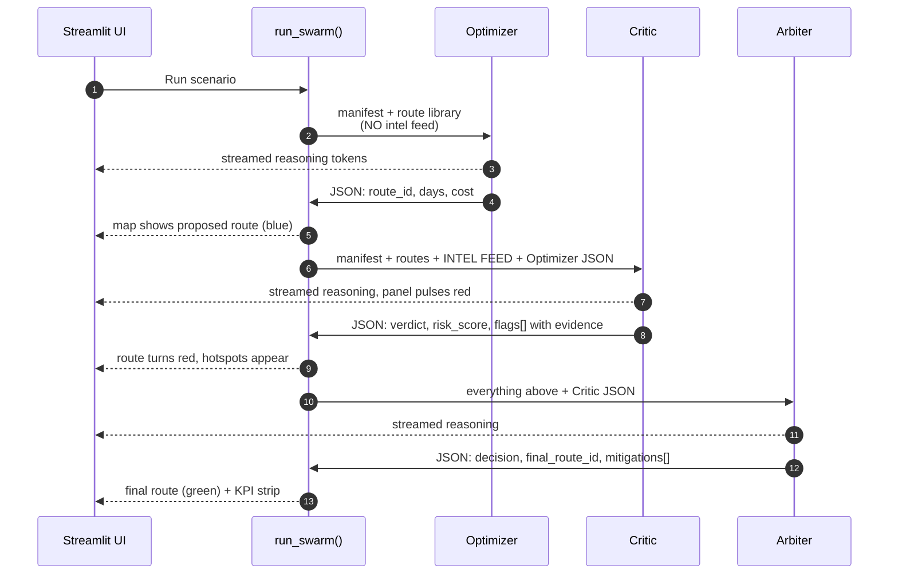
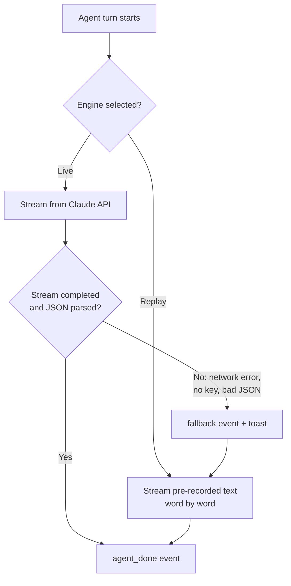
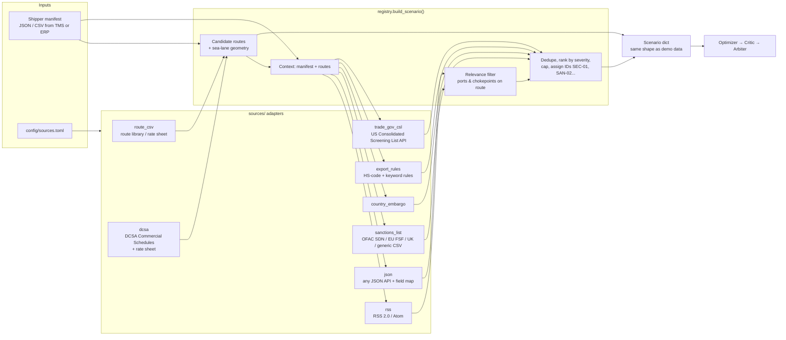
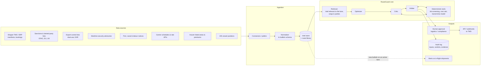

# RouteGuard: System Architecture

This document covers three things:

1. **What is built today.** This is the hackathon demo, running at [routeguard39.streamlit.app](https://routeguard39.streamlit.app).
2. **The connector layer (built).** This is how the same agents run on a real manifest and real-world sources (section 6).
3. **The production design.** This covers what gets added around the connectors for real deployment (section 7).

---

## 1. Design goals

| Goal | How the design meets it |
|---|---|
| **Catch risk that route optimizers miss** | A separate adversarial agent whose only job is to break the plan |
| **Decisions a human can audit** | Every Critic flag must cite a bulletin ID or manifest field. Every agent emits a strict JSON verdict next to its reasoning. |
| **Never recommend something that can't be executed** | Agents may only choose a route from the route library. Compliance ranks above cost in the Arbiter's rules. |
| **Demo-proof** | A replay engine needs no network. The live engine falls back to replay automatically if a call fails. |
| **Explainable in real time** | Every agent's reasoning is streamed to the UI token by token |

---

## 2. Current system (demo)



### Components

| File | Responsibility |
|---|---|
| `agents.py` | The three system prompts (Optimizer, Critic, Arbiter), the strict output contract, and `build_user_message()`, which decides what each agent is allowed to see |
| `pipeline.py` | The sequential loop `run_swarm()`, which yields a stream of `Event`s. It also holds the two interchangeable engines, the JSON parser and a CLI. |
| `scenarios.py` | All demo data: manifests, candidate routes (with lat/lon legs for the map), simulated intel bulletins, map hotspots and replay scripts |
| `app.py` | Streamlit UI: consumes events, streams text, turns red on the Critic, redraws the map at each stage, shows KPIs. Also has a "Connected sources" mode (upload a manifest, see per-source status). |
| `sources/` | Data connectors for real feeds and lists → the same scenario shape (see section 6) |
| `config/sources.toml` | Which sources are on, and where they point |

---

## 3. The agent loop



### Re-check after breaking news

When a new bulletin arrives after the decision, `pipeline.run_recheck` runs a shortened loop. The bulletin goes to the top of the intel feed, marked `new`, and `ctx` is seeded with `current_plan` (the previous Arbiter verdict). Only the Critic and the Arbiter run. The Critic attacks the booked plan rather than a fresh proposal, and the Arbiter is told that re-routing an existing booking has real cost, so PROCEED is a valid answer. Each re-check becomes the next booked plan, so events can be chained. Curated scenarios carry a pre-recorded `twists` entry for Replay. Free-text bulletins (Live only) are placed on the map by the same deterministic place matching the connectors use (`sources.geo.match_location`).

### Why this shape

- **The Optimizer is deliberately blind to the intel feed.** This models how traditional routing software behaves: it optimizes time and cost against a static rate table. The gap between its plan and the Critic's findings *is* the product's value, and it's visible to the judges.
- **The Critic only attacks.** A single prompt asked to "find the best safe route" tends to settle on a middle answer. A dedicated adversary with a mandate to reject finds more failure modes, including second-order ones like insurance exclusions or a line-critical container missing its window.
- **The Arbiter decides by fixed rules, not by vibes.** Its priorities are hard-coded in the prompt: **legal compliance → cargo and crew safety → deadline → total cost including risk.** That's why it will pay more for the Cape route, and why it will never pick a sanctioned port however cheap it is.
- **Sequential, not parallel.** Each agent needs the one before it. That also makes the demo easy to follow: plan, attack, resolve.

### Output contract (grounding and guardrails)

Every agent returns free-text reasoning, then a `<json>…</json>` block. `split_output()` separates the two:

| Agent | Key fields | Guardrail |
|---|---|---|
| Optimizer | `route_id`, `transit_days`, `est_cost_usd`, `meets_deadline` | `route_id` must be from the route library |
| Critic | `verdict`, `risk_score`, `flags[severity, category, title, detail, evidence]` | Each flag must cite a bulletin ID or manifest field; it is told not to invent facts |
| Arbiter | `decision`, `final_route_id`, `mitigations[]`, `residual_risk_score`, `summary` | Must address every CRITICAL flag and pick from the library |

Constraining choices to a known route library means the model **selects and justifies**; it does not generate routes. That's the main defense against hallucinated routes.

---

## 4. Reliability: the two engines



- Both engines share one method: `stream(agent, scenario, user_msg) -> Iterator[str]`. The loop doesn't know which one it's using.
- Once a live call fails, the rest of that run stays on replay, so the audience never sees a half-finished run.
- In Replay mode the demo never touches the network after the page loads.

---

## 5. Data model

```
Scenario
├── manifest        shipment_id, origin, destination, cargo, HS code, value, deadline, notes
├── routes{id}      name, via[], transit_days, est_cost_usd, notes, legs[{mode: sea|land|air, pts[(lat,lon)]}]
├── intel[]         id, time, source, severity, text          ← SIMULATED for the demo
├── hotspots[]      name, lat, lon, label, pos                ← map markers the Critic "lights up"
├── map_center      lat, lon, scale
└── script{agent}   narration, json                           ← used only by Replay
```

---

## 6. Connecting real data (built)

The `sources/` package lets the agents run on a real shipment and real-world feeds. Every adapter converts its native format into one **Bulletin** schema, the same shape the Critic already reads and cites. So adding a source never changes the agents.



### Source → adapter map

| Real-world source | Adapter (`type`) | Native formats handled | What it produces |
|---|---|---|---|
| **Maritime security advisories** | `rss`, `json` | RSS 2.0, Atom, any JSON API (dotted-path field mapping) | `Security` bulletins, kept only if they mention a port or chokepoint on a candidate route |
| **Sanctions lists (OFAC, EU, UK)** | `sanctions_list` | OFAC `SDN.CSV` (no header), EU Financial Sanctions Files CSV (`;`-separated), UK consolidated CSV (Name 1–6), generic CSV | Screens **every party**: shipper, consignee, notify party, forwarder, end user, carrier and route operators/terminals. Match = CRITICAL, near-match = HIGH "needs review". |
| | `country_embargo` | Config map of ISO-2 → regime | CRITICAL if any candidate route passes through, or delivers to, a configured jurisdiction |
| **Export-control lists** | `export_rules` | CSV rules: HS prefix and/or cargo keywords → control code, regime, licence rule, destinations | CRITICAL when a licence is required and none is on the manifest; HIGH to confirm when one is |
| | `trade_gov_csl` | US Consolidated Screening List API (needs a free key) | Party hits across US export-control and sanctions lists |
| **Counterparty web footprint** | `similarweb` | Similarweb v1 visits + v4 traffic-by-country (URL templates configurable), or sample JSON in the same shape | `Counterparty` bulletins (`KYC-xx`) for parties with a website: HIGH for negligible traffic or traffic concentrated in a watched country, MEDIUM when Similarweb has no data. Labelled leads for review |
| **Canal & port authority notices** | `rss`, `json` | Same as above | `Canal/Port` bulletins |
| **Carrier schedules & rates** | `dcsa` | DCSA Commercial Schedules point-to-point routings (`legs`, `UNLocationCode`, `transitTime`), priced from a rate-sheet CSV | Candidate routes with transit days, cost, carrier, sea/rail/truck legs |
| | `route_csv` | Your own route library / rate sheet | Candidate routes, including the operators to screen |
| **Shipper manifest** | `load_manifest()` | JSON, CSV (header + row, or key/value) with alias mapping (`port_of_loading`→`origin`, `commodity`→`cargo`, `invoice_value`→`declared_value_usd`, dates → days…) | The manifest the agents read |

### Relevance, ranking and grounding
1. **Routes first.** Candidate routes are loaded before any intel, because "relevant" means *on one of these routes*.
2. **Geography.** Port-to-port legs are expanded along a coarse global **sea-lane graph** (`sources/sealanes.py`), so a Singapore → Port Said leg passes Malacca, Bab el-Mandeb and Suez instead of cutting across Arabia. The chokepoints each route passes within 350 km of become match targets.
3. **Filtering.** Feed items must mention a route port/chokepoint (or a configured keyword), and be younger than `max_age_days`.
4. **Ranking.** Bulletins are deduped, ranked CRITICAL → HIGH → MEDIUM, capped (`max_bulletins`), and given citable IDs (`SEC-01`, `SAN-02`, `EXP-01`, `PORT-03`...). The Critic's evidence rule is unchanged.
5. **Map.** Bulletins that resolved to a place become hotspots automatically.

### Failure behaviour
- A failing source (timeout, bad format, missing key) is **reported and skipped**, never fatal. The UI shows a per-source status table.
- HTTP responses are cached on disk (`.cache/`, 15 min for feeds, 6 h for sanctions lists).
- Connected-data runs have no replay script, so they always use the Live engine. The UI says so and asks for a key.

### Adding a new source
Write a class with `fetch(ctx) -> list[Bulletin]` (or `routes(manifest) -> dict` for route providers), register it in `INTEL_TYPES` / `ROUTE_TYPES` in `sources/registry.py`, and add a `[[intel]]` block to the config. Tests live in `tests/test_sources.py` (`python -m unittest discover -s tests`).

---

## 7. Production architecture (roadmap)

The agent core (`agents.py` and `pipeline.py`) and the `sources/` layer stay the same. What gets added is scheduling, deterministic tools, and human approval.



### What changes between demo and production

| Concern | Curated demo | Connected sources (built) | Production |
|---|---|---|---|
| Intel | Hand-written, simulated bulletins | RSS/Atom/JSON adapters, filtered to the route (ships pointing at sample files) | Same adapters pointed at licensed live feeds |
| Routes | 3–4 curated routes per scenario | Route-library CSV + DCSA schedules + rate sheet | Live carrier APIs and contracted rates |
| Sanctions screening | The LLM reads a bulletin | Deterministic list screening of every party + jurisdiction check | Plus your compliance team's screening provider as source of truth |
| Export controls | Bulletin | HS/keyword rules + optional trade.gov CSL | Rules maintained by the classification team |
| Cost & transit | Static numbers | From the route sources | Calculators the agents call as tools |
| Trigger | A person clicks "Run" | Same | Also runs automatically when a new bulletin touches a lane with cargo already moving |
| Decision | Displayed | Displayed | Routed to a human for approval, pushed to the TMS, fully logged |

---

## 8. Tech stack

| Layer | Choice | Why |
|---|---|---|
| UI | Streamlit | Fastest way to show real-time token streaming in a hackathon |
| Map | Plotly `Scattergeo` | Clear geo lines with dashed land and dotted air legs, no API key |
| LLM | Claude via the Anthropic Messages API (streaming), default `claude-sonnet-5-5` | Strong reasoning and reliable structured output; configurable in the sidebar or with `ROUTEGUARD_MODEL` |
| Language | Python 3.10+ | |
| Hosting | Streamlit Community Cloud | Free and deploys from GitHub on every push |
